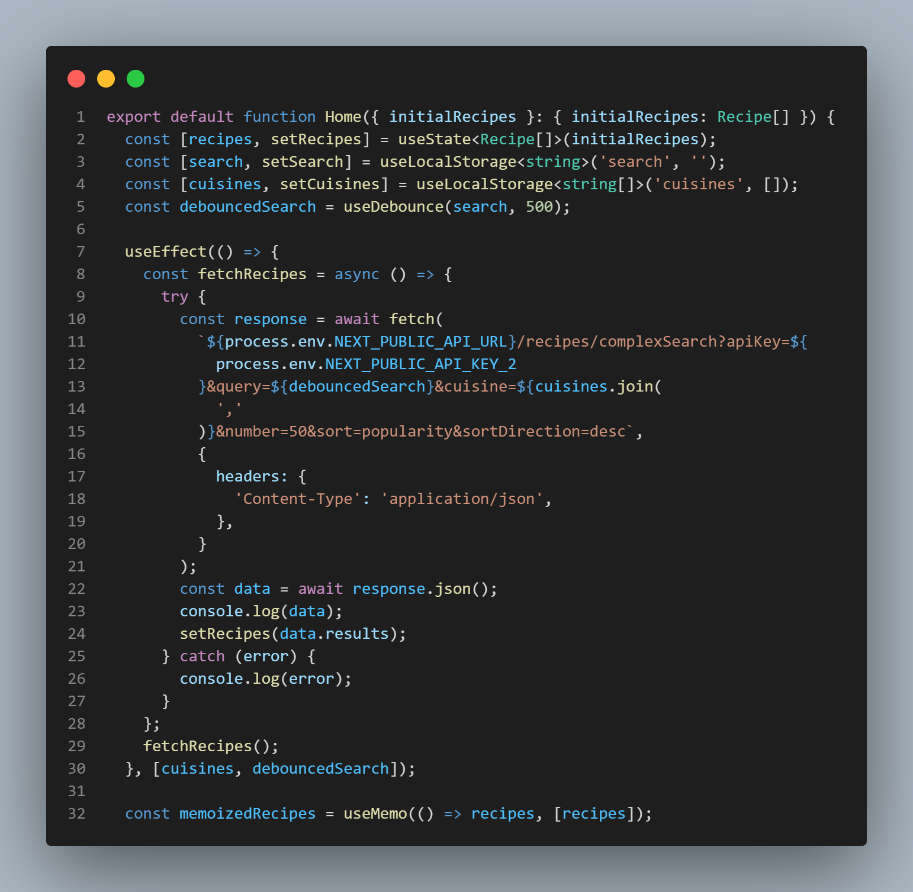

# Kitchenette

[](https://www.codefactor.io/repository/github/marcelrm11/food-app)

## Description

I have a passion for planning and tracking. I need to cook (almost) every day, and sometimes is difficult to find what to cook. It is also difficult to optimize food waste, and countless times I had to throw away food because it had perished.

If only I had a way to keep track of the food I have and get suggestions of what to cook on the spot, or be able to plan the weekly meals ahead, perfectly adapted to the food I have and to my taste...

That's where Kitchenette will make me happy. It will:

- Keep track of my food storage.
- Remind me when something is about to expire.
- Suggest me recipes to cook based on what I have, what I like and when it will expire.
- Help me with meal plans that optimize grocery shopping and health.

## Table of Contents (Optional)

- [Installation](#installation)
- [Usage](#usage)
- [Credits](#credits)
- [License](#license)

## Installation

```shell
npm install
npm run dev
npm run build
npm run start
```

## Usage

This project uses React hooks to manage the display and different API calls.



## Credits

List your collaborators, if any, with links to their GitHub profiles.

If you used any third-party assets that require attribution, list the creators with links to their primary web presence in this section.

If you followed tutorials, include links to those here as well.

## License

The last section of a high-quality README file is the license. This lets other developers know what they can and cannot do with your project. If you need help choosing a license, refer to [https://choosealicense.com/](https://choosealicense.com/).

---

## Features

If your project has a lot of features, list them here.

## How to Contribute

If you created an application or package and would like other developers to contribute it, you can include guidelines for how to do so. The [Contributor Covenant](https://www.contributor-covenant.org/) is an industry standard, but you can always write your own if you'd prefer.

## Tests

Go the extra mile and write tests for your application. Then provide examples on how to run them here.

## Deploy on Vercel

The easiest way to deploy your Next.js app is to use the [Vercel Platform](https://vercel.com/new?utm_medium=default-template&filter=next.js&utm_source=create-next-app&utm_campaign=create-next-app-readme) from the creators of Next.js.

Check out our [Next.js deployment documentation](https://nextjs.org/docs/deployment) for more details.
